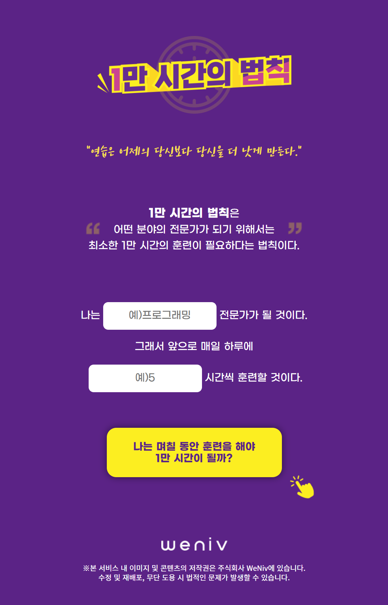

# vending_machine

## Homepage

</img>
</img>

## Repository Description

반응형 페이지로, width의 넓이에 따라 페이지가 달라지게끔 미디어쿼리를 적용했습니다. 얼마나 공부를 하면 10000시간을 채울 수 있을지 계산해주는 사이트입니다.

## How to drive

공부 내용과 시간을 입력하고 버튼을 누르면 며칠이 걸릴 지 계산해줍니다. 계산 후 나오는 공유하기를 누르면 현재 페이지의 url을 복사하여 클립보드에 넣어줍니다.

</img>
</img>

공유하러가기 버튼을 누르면 modal창을 띄워줍니다.

</img>
</img>